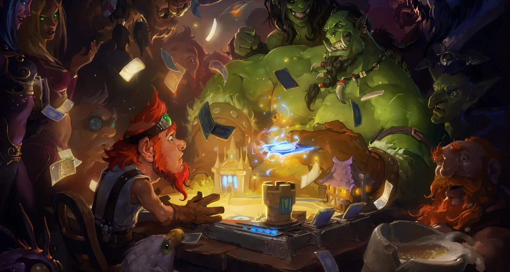

<h1>Hand Game🏰🪄 </h1>
 

Tensões entre Feras e Humanos, ou entre Magos e Bruxo, Reis, Rainhas, Princesas, Príncipes contra o seu inimigo se resolvem entre uma disputa, seja qual for o resultado... 
Enfim, há diversos exemplos quando o assunto é o mundo da fantasia e foi dessa  inspiração que decidi fazer esse jogo. 
Foi um projeto do módulo de JS do curso de Full Stack da Dev Club, no qual, foi executado juntamente com os ensinamentos do mentor Rodolfo Mori. 
Além do uso do HTML e CSS, para deixa-ló todo atraente, a interação ficou para o JavaScript. 
Assim, o jogo se passa em uma disputa de "pedra-papel-tesoura". E a partir das funções definidas no JS, o usuário pode começar a batalha. 
🔮🃏🐉
 

